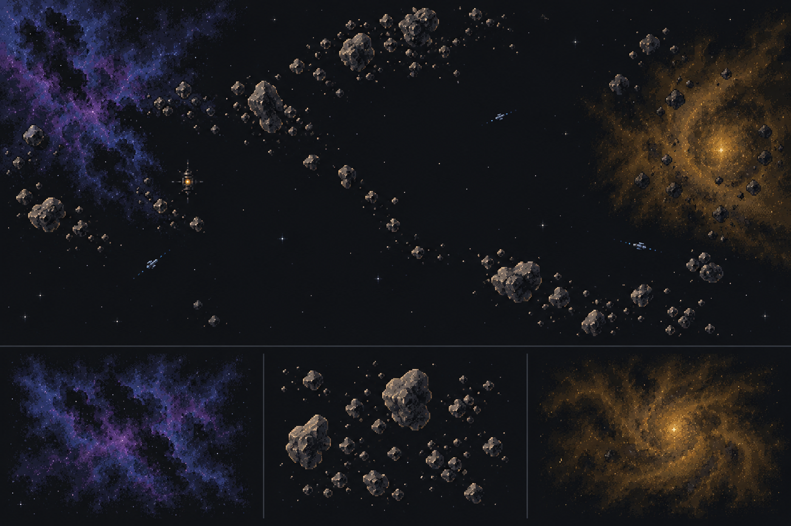

# Terrain art and command presentation specification

Date: 2026-10-06. Status: **Proposed design with one generated concept study; no renderer changes.** Parent: [Operations roadmap](2026-10-06-operations-and-consequences-roadmap.md). Execution: [Presentation plan](../plans/2026-10-06-terrain-and-command-presentation.md).

## V1 Visual direction

Space should look expansive, navigable and inhabited. Use a restrained top-down pixel-art language compatible with the existing ship sprites: dark navy and near-black space, sparse stars, irregular cloud materials, broken asteroid clusters and modest electrical structure in ion storms. Ship silhouettes, ownership, active threats and selected objectives have higher contrast than the environment.

Preserve substantial negative space. A mission must not look like a full-screen nebula painting with unreadable ships. The initial composition target is roughly 60 percent quiet space in an operational overview; this is a visual review guide, not a gameplay terrain quota. Avoid large decorative planets, dense sparkling starfields, oversized rocks, painted UI text and continuous dramatic flashes.

This is an art-direction study generated with the built-in image tool. It is not a production atlas, implemented UI or mechanically accurate mission layout. Its irregular rocks and clouds suggest materials and spacing. The storm core is brighter than desirable behind combatants; production art needs lower contrast there. Consistent native pixel size, transparency, palette, tiling and tactical readability remain production checks. The exact generation prompt and production prompt templates are in the [asset notes](../design-assets/2026-10-06-terrain/README.md).

## V2 Truthful terrain layers

Separate four layers:

1. **Distant background:** subdued stars and dust; no collision, cover, targeting or information.
2. **Terrain material:** world-anchored clouds, rock clusters and storm texture composed from reusable bitmap assets.
3. **Tactical geometry:** exact current hazard boundaries, storm core/ring, range, capture and extraction areas drawn from authoritative game data.
4. **Ships and commands:** hulls, allegiance cues, orders, paths, targets, text and accessible interaction surfaces.

Replacing oval fills does not authorize changing terrain physics. Initial production art retains the current circular region queries. Irregular detail fills and softens their presentation; a subdued boundary remains available and becomes prominent during relevant movement, tow and targeting interactions. An always-visible tactical-boundaries preference supports players who want exact regions. The simplified view uses geometry and patterns without requiring images.

Cloud wisps outside a region may be faint atmosphere, but dense hazard-looking material must not imply a different rule edge. Within a region, a visually open patch between rocks is still hazardous under current area rules; it must not look like a reliable safe passage. Actual safe belt gaps must be gaps between mechanical regions. Large background rocks outside hazards should be omitted if players confuse them with cover.

The first tranche does not use alpha pixels as collision masks, add individual solid rocks, change asteroid crossing/end-position rules, or introduce moving storm physics. True polygonal regions or per-rock collision would need a separate specification, point/segment queries, AI path evaluation, migration and both timing-mode measurements.

## V3 Terrain material vocabulary

| Feature | Material and form | Tactical cue | Avoid |
| --- | --- | --- | --- |
| Nebula | Irregular violet/blue filaments, soft pixel clusters and dark pockets | Sensor-denial pattern/icon and contextual edge | Opaque cloud hiding friendly ships; a cloud pretending to reveal unseen enemies |
| Asteroids | Several coherent rock sizes with upper-left lighting, broken clusters | Cover/hazard hatch and exact region edge when planning | Each decorative rock appearing to be an individual collision object |
| Ion storm | Amber/ochre dust with sparse electrical veins; distinguish core from outer ring | Separate full-jam core and degraded ring contours/icons | Persistent flashes, white bloom or a core indistinguishable from the ring |
| Relay | Small constructed beacon with a stable silhouette | Capture perimeter and owner shape/color | Confusing decorative machinery with a capturable objective |
| Extraction | Small navigation beacon and subtle edge markers | Exact extraction region, eligibility and boundary timing | Looking like a repair station or an invulnerable safe bubble |

Environment palettes are not ownership. Existing faction colors and shapes remain attached to hulls and objective ownership. Test Cabal violet over a nebula and Bloc gold over a storm, with neutral/prize/vacant cues at both overview and close zoom. Essential distinctions use shape, texture and text as well as hue.

## V4 Projection and sense of scale

The current `#map` is commonly rectangular, while `#map-field` fills it and terrain width/height use the same percentages. A circular world region can consequently appear oval. The new Reimagined presentation should use an isotropic world projection: one world unit has the same pixel scale horizontally and vertically. A rectangular viewport shows different world spans in each direction; it does not stretch the world.

Implement this as one camera/projection contract used by terrain, ships, range rings, movement previews, clicks, hit tests, beam endpoints, playback and minimap viewport bounds. Do not fix only the CSS border radius. Keep Classic's current presentation path stable unless a separately verified shared improvement is deliberately adopted.

Provide two camera actions: **Operation overview** to fit the known mission geography, and **Follow command ship** for tactical command. Returning from overview preserves an explicit tactical zoom. New mission briefings show the whole operation, then enter tactical view centered on the deployment. No unsolicited camera jump on ordinary radio traffic. Offscreen objective and friendly-order indicators must distinguish public geography from observed enemy positions.

Add a world-distance scale bar and, during a move, a route distance and estimated travel under current engine effectiveness. Label real-time estimates as estimates when hazards, damage or future orders can change them. Turn-based travel takes player commands and fleet rounds; do not display a misleading wall-clock ETA. Preserve pan, cursor-anchored zoom, minimap selection and keyboard targeting.

Ships retain a usable minimum screen size. At overview, simplify low-priority material and use hull glyphs if needed. Do not increase apparent ship size simply because the world grew. Test world alignment across zoom levels, especially where the existing renderer offsets crowded sprites for legibility.

## V5 Mission and command interface

Use the existing console/journal layout as the foundation rather than a complete interface rewrite. The operation briefing answers: why we are here, what counts as success, what must return, known opposition, deadline convention, and optional opportunity. It identifies any operation movement profile explicitly.

Keep a compact objective/priority strip near the map: primary progress, extraction status, deadline and at most a few actionable notices. Show detail on demand. Notices are derived from observed facts or authored public conditions and prioritized by consequence. Avoid repeating a routine warning every simulation tick. Dismissal does not alter the underlying rule.

For selected commands, emphasize only relevant overlays: movement and hazards for a course, legal tow reach and destination for rescue, exposed arcs for a visible target, capture range for boarding and exit eligibility for extraction. Keep exact boundaries available by keyboard as well as pointer. No full future damage prediction or hidden enemy intentions.

Order rows show issuer, subject, phase, destination, radio-pending state and blocking reason. A route preview must not promise that an AI-controlled hull will follow an unvalidated path. Explain an accepted order separately from a completed action.

The debrief leads with mission outcome, actual returned hulls, missing/abandoned/lost hulls, optional recovery and campaign consequence. Then show damage needing attention and available explicit repairs. Collapse unchanged per-hull statistics. Service history remains reachable; medals or visual milestones cannot imply new combat bonuses.

## V6 Audio and motion

Build on `ui/sound.js` and existing battle FX. Distinguish contact gained, objective secured, distress escalation, shields hit and critical internal damage through short restrained cues. Captain acknowledgments use concise deterministic text first. Any later voice asset must have equivalent captions and explicit production scope; do not add a speech or generative service at runtime.

Ambience, effects and alerts have separate volume controls and an effective mute. Sound follows browser activation rules. Real-time critical-event pause is optional and reports why it triggered; acknowledge it without advancing the simulation. A change in art, sound or pause preference consumes no gameplay randomness.

Terrain motion is initially absent or extremely restrained. Reduced motion disables decorative drifting, flicker and camera movement while retaining static warning cues. Existing pause/help/replay locks remain authoritative. No animation creates a hidden storm movement rule.

## V7 Asset production contract

Use the built-in image-generation tool for new raster concepts and production candidates. Start with one nebula material, one asteroid cluster set, one ion material and one extraction beacon. Review them in the game before commissioning variants. Generated pixels are candidates: models do not guarantee an exact pixel grid, seamless edges, alpha or a valid atlas simply because the prompt asks.

Proposed production sizes: cloud/storm base modules at 128 or 256 native pixels; individual rock sprites at 16, 32 and 64 pixels; objective beacons at 24 or 32 pixels. Choose the accepted native scale after comparing against existing hull art. Use nearest-neighbor integer scaling for asset inspection and appropriate pixel-preserving filtering in the renderer. Camera geometry must remain accurate at fractional zoom; avoid forcing world positions onto coarse pixel steps.

Request transparent isolated assets when required and verify actual alpha, including dark fringes. Use modest bounded palettes compatible across materials. Keep highlights subordinate to ships. Document source prompt, generation method/date, actual dimensions, alpha, intended world footprint, palette decision and export transformation for every accepted asset. Names and labels remain code-rendered text.

Do not use the concept board as a full-map background or silently crop its studies into final assets. It contains baked stars, separators and ship scale references. Produce individual assets, then compose them deterministically using terrain identity and a presentation-only seed/hash. Rendering cannot advance game, terrain-placement or mission RNG.

Put accepted production files under `assets/terrain/` with a manifest and explicit byte/dimension budgets. Keep concept sheets and rejected candidates under documentation or temporary evidence, outside production references. First target: no more than 2 MiB of additional compressed terrain imagery for the prototype and no more than 16 MiB decoded RGBA asset memory, measured rather than assumed. Exceeding these requires reducing variants or a documented measured tradeoff, not automatic silent scope growth.

Rendering remains dependency-free at runtime. Use cached repeated images, bounded composition, viewport culling and levels of detail as appropriate; select DOM/canvas only after inspecting actual costs. Do not rebuild thousands of rock nodes every real-time tick. Load assets before exposing a completed scene; failures retain accurate geometry and commands.

## V8 Acceptance

**October 10 pilot:** the [implementation review](../reviews/2026-10-10-terrain-pilot.md) records isotropic projection, strong/quiet boundaries, optional generated materials and measured parity/performance. Source PNGs exceed the provisional asset budgets; their use is limited to this documented pilot pending native export and human review. The acceptance contract below remains open and unchanged. A5/A6 hierarchy and audio are later slices.

Inspect the actual game at 1366×768 and 1600×1000, a narrow layout, native 200-percent browser zoom, keyboard-only input, reduced motion, classic view, glyph/sprite ships and grayscale. Check representative maximum and minimum camera zoom, dense fights, terrain overlap, image-load failure and saved-session restoration. The concept image alone establishes none of this.

Players must identify the asteroid hazard edge, storm core/ring, a genuinely safe gap, a visible hostile, a prize and the extraction region without author explanation. Ask what is decorative and what changes gameplay. Revise artwork that suggests false cover or conceals target ownership.

Measure render time and frame pacing on the same recorded machine/browser and fixed scene before/after. Initial real-time target is smooth 60 Hz presentation on the chosen desktop reference, with p95 total frame time within 16.7 ms in the small operation, or a documented reference limitation. Stress a larger ordinary fleet separately; art should not worsen its measured p95 by more than 10 percent without a consciously accepted tradeoff. Report actual values and asset memory. Neither a screenshot nor an average FPS claim proves responsiveness.

Presentation toggles, image failures, camera changes, sound and replay must preserve authoritative simulation/RNG state on identical scripted inputs. Screenshot approval, human readability and mechanical parity are separate acceptance results.
